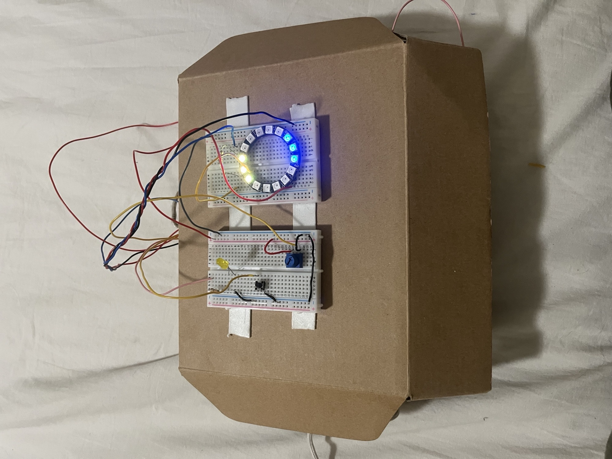
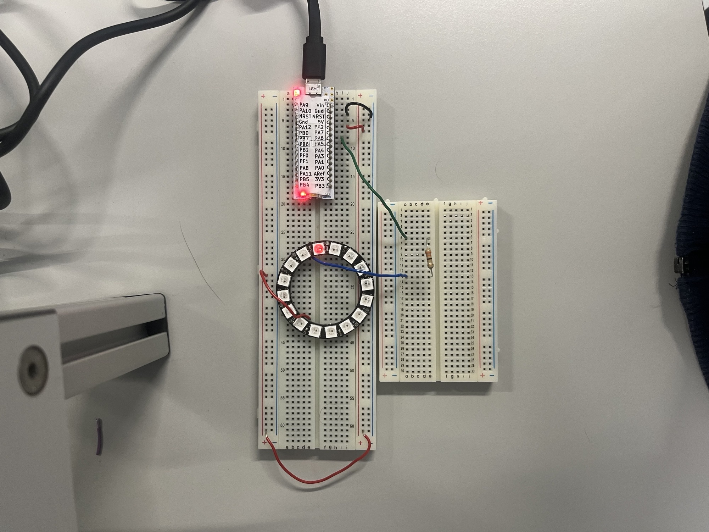
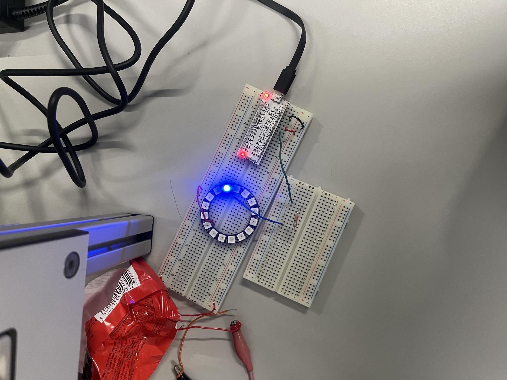
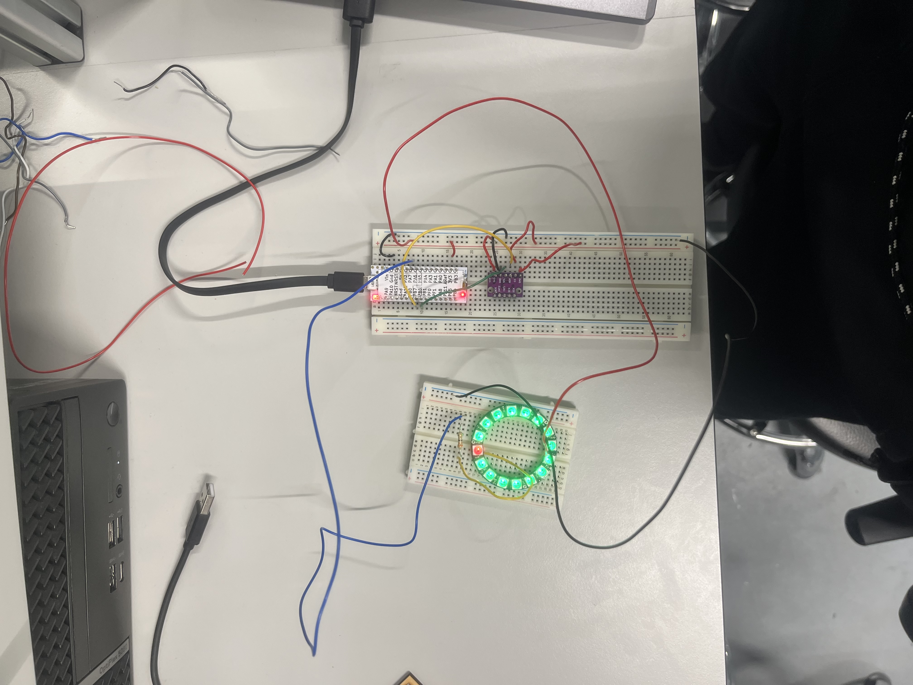
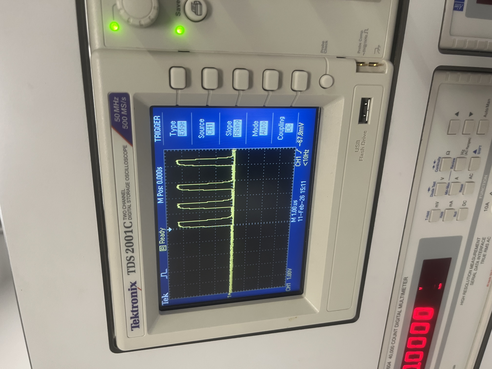
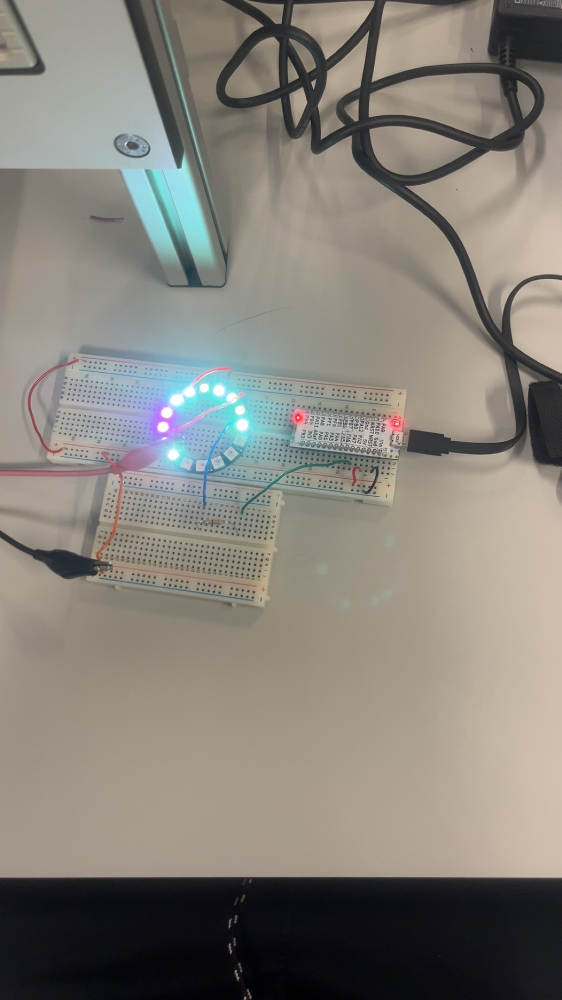

# Embedded-tilt-led-ring

STM32 embedded system using accelerometer, ADC, PWM and WS2812 LED ring

### Overview

This project implements a tilt-controlled LED ring system using an STM32L432 microcontroller and a BMI160 accelerometer. The system detects the orientation of the device in real time and displays the direction using a WS2812B LED ring.

The project demonstrates embedded programming, peripheral interfacing, real-time signal processing, and debugging techniques.

### Objectives

The objectives of this project were:

\- Interface with an accelerometer using I2C

\- Control a WS2812B LED ring using precise timing

\- Implement real-time tilt detection

\- Map direction to LED position

\- Implement filtering for stable output

\- Demonstrate use of ADC and Timer peripherals

\- Apply structured testing and debugging methods

### System Description

The system reads acceleration data from the BMI160 sensor and calculates the direction of tilt using the X and Y axes. This direction is mapped onto a 16-LED ring.

Key features:

\- A 3-LED pointer indicates tilt direction

\- A dead zone prevents jitter when stationary

\- A potentiometer allows saving a position

\- A button cycles through colour modes

\- Saved positions remain visible while live tracking continues

### Hardware Used

\- STM32L432 (Nucleo board)

\- BMI160 accelerometer (I2C)

\- WS2812B LED ring (16 LEDs)

\- Potentiometer (ADC input)

\- Push button (GPIO input)

\- Resistor for LED data line

\---

### Peripherals Used (LO1)

|**Peripheral**| **Purpose** |

|----------|-----------|

| GPIO     | L*ED control, button input* |

| I2C      | *Communication with BMI160* |

| ADC      | *Read potentiometer* |

| Timer(PWM)| *LED brightness control* |

| UART     | *Debug output* |

### Software Design

The software is structured into modular functions:

\- Sensor reading (I2C)

\- Signal processing (filtering + mapping)

\- LED control (WS2812 protocol)

\- Input handling (button + potentiometer)

A low-level register-based approach was used instead of full HAL abstraction.

### Software Development Procedure (LO5)

The system was developed incrementally, testing each subsystem before integration.

#### Stage 1: WS2812 LED Control

Initial implementation used SPI but produced unstable results. This was replaced with direct GPIO control using the DWT cycle counter for precise timing.

#### Stage 2: LED Mapping

Individual LED control was verified. Issues with indexing and colour inconsistencies were resolved.

#### Stage 3: I2C Sensor Integration

The BMI160 was interfaced via I2C. Raw acceleration values were read and scaled correctly.

#### Stage 4: Basic Tilt Detection

Single-axis tilt was mapped to LED colour output to verify system behaviour.

#### Stage 5: Multi-Axis Processing

Both X and Y axes were used to detect direction. A dominant-axis method avoided conflicting outputs.

#### Stage 6: Direction Mapping

Tilt direction was mapped to LED positions using a dot-product method with predefined vectors.

#### Stage 7: Filtering

A low-pass filter was applied to reduce noise and stabilise the output.

### Testing and Results (LO4)

Each subsystem was tested individually.

#### Test 1: LED Communication

\- Method: Illuminate LEDs sequentially

\- Result: Stable output achieved after timing correction

#### Test 2: LED Indexing

\- Method: Activate each LED individually

\- Result: All LEDs correctly mapped

#### Test 3: I2C Communication

\- Method: Read sensor data via UART

\- Result: Values updated correctly with tilt

#### Test 4: Tilt Detection

\- Method: Manual tilting

\- Result: Direction correctly reflected in LED output

#### Test 5: Direction Mapping

\- Method: Rotate device through 360°

\- Result: LED pointer follows direction accurately

#### Test 6: Filtering

\- Method: Compare filtered vs raw signals

\- Result: Reduced jitter and smoother movement

### Debugging Methods

A combination of debugging techniques was used:

#### Software Debugging

\- UART was used to print raw and filtered accelerometer values

\- This verified correct I2C communication and data scaling

#### Ad-hoc Debugging

\- LEDs were used to visualise system state and direction mapping

\- GPIO toggling was used to verify timing accuracy of WS2812 signals

\- Step-by-step subsystem testing was used to isolate faults

#### Hardware Debugging

\- An oscilloscope was used to verify the WS2812 data signal

\- The waveform at the data pin was observed to confirm correct pulse timing and signal presence

\- This helped identify issues with the initial communication method and confirmed correct operation after implementing precise timing control

### Circuit Design

A schematic was created using KiCad.

Connections include:
- I2C lines (SDA, SCL) to BMI160
- GPIO output to LED ring data input
- Potentiometer connected to ADC pin
- Button connected with pull-up resistor

[View Full Schematic PDF](Circuit_schematic.pdf)

---

### System Images

#### Working Project

#### Initial LED Ring Configuration

#### LED Colour Configuration

#### LED Configuration Mapping

#### Debugging WS2812 Signal (Oscilloscope)

#### Incorrect Protocol Debugging

### Results Summary

The final system:

\- Accurately detects tilt direction

\- Displays direction using LED ring

\- Provides stable output using filtering

\- Allows user interaction via button and potentiometer

The system is responsive, stable, and meets all project objectives.

#### Video Demonstration

https://youtu.be/A2sVNCb3\_ys

